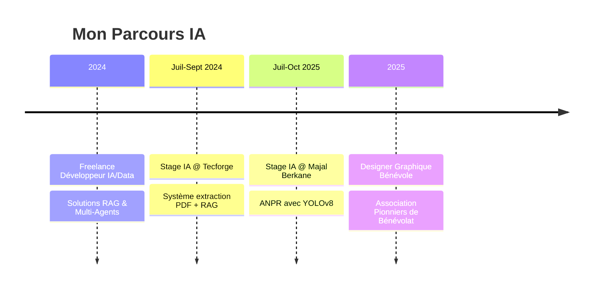

<div align="center">
  
# Salut, je suis Ahmed Hajji
  
### Ingénieur IA | Data Scientist | Innovateur Tech 

[](https://github.com/Hajji-ahmed)
[](https://github.com/Hajji-ahmed?tab=followers)
[](https://www.linkedin.com/in/ahmed-hajji-840956336/)

</div>

---

## À propos de moi

```python
class AhmedHajji:
    def __init__(self):
        self.role = "Étudiant Ingénieur IA"
        self.school = "ENIAD (École Nationale d'IA et du Digital)"
        self.location = "Berkane, Maroc"
        self.passions = ["Machine Learning", "Deep Learning", "Data Science"]
        self.current_focus = ["LLMs", "RAG", "Computer Vision", "Multi-Agents"]
        
    def say_hi(self):
        print("Transformons ensemble les données en décisions intelligentes!")

me = AhmedHajji()
me.say_hi()
```

**Formation**: Ingénierie en Intelligence Artificielle @ ENIAD (2023-Présent)  
**Expérience**: Stagiaire IA chez Tecforge & Majal Berkane | Freelance IA/Data  
**Contact**: ahmed.hajji.23@ump.ac.ma | ahmdhajy301@gmail.com  
**Téléphone**: +212 603 251 761

---

## Stack Technique

<div align="center">

### Intelligence Artificielle & Machine Learning


**Deep Learning**: CNN, RNN, LSTM, Transformers, Transfer Learning  
**ML Classique**: Supervised/Unsupervised Learning, Ensemble Methods, RL  
**NLP & LLMs**: GPT, BERT, Mistral, LLaMA, Prompt Engineering, RAG  
**Computer Vision**: YOLOv8, Object Detection, OCR, Image Segmentation

### Data Science & Analyse


**Data Engineering**: ETL/ELT, Feature Engineering, Data Cleaning  
**Visualisation**: Power BI, Matplotlib, Seaborn, Plotly  
**Big Data**: Hadoop, Spark, Distributed Processing

### Développement & DevOps


**Langages**: Python, Java, C/C++, C#, SQL, JavaScript/TypeScript  
**Web**: React.js, Next.js, FastAPI, Streamlit, .NET  
**DevOps/MLOps**: Docker, CI/CD, MLflow, Azure, AWS  
**Frameworks IA**: LangChain, LangGraph, CrewAI

</div>

---

## Projets Phares

<table>
<tr>
<td width="50%">

### SmartGuide - Plateforme IA Touristique
Système RAG intelligent avec recommandations personnalisées pour la promotion touristique
- **Tech**: RAG, LLMs, Vector DB
- **Impact**: Réponses contextuelles en temps réel

</td>
<td width="50%">

### ANPR - Reconnaissance de Plaques
Système complet de contrôle d'accès parking avec reconnaissance automatique
- **Tech**: YOLOv8, CRNN, OpenCV
- **Précision**: Traitement temps réel

</td>
</tr>
<tr>
<td width="50%">

### Système Multi-Agents Recherche
Agents autonomes collaboratifs pour assistance à la recherche scientifique
- **Tech**: LangChain, LangGraph
- **Features**: Web scraping, synthèse, rapport auto

</td>
<td width="50%">

### GreenH2Smart - Hydrogène Vert
Plateforme IA pour optimiser production/distribution H2 vert
- **Tech**: ML, IoT, Analytics
- **Objectif**: Efficacité énergétique industrielle

</td>
</tr>
</table>

---

## Statistiques GitHub

<div align="center">
  
[](https://github.com/Hajji-ahmed)

[](https://github.com/Hajji-ahmed)

[](https://github.com/Hajji-ahmed)

</div>

---

## Expérience Professionnelle



---

## Certifications

<div align="center">

| Certification | Organisme |
|--------------|-----------|
| AI Foundations | Oracle |
| Machine Learning with Python | IBM |
| Data Analysis with Python | IBM |
| Data Visualization | IBM |
| Analyste Data | Microsoft/LinkedIn |
| SQL Fundamentals | Simplilearn |

</div>

---

## Connectez-vous avec moi

<div align="center">

[](https://www.linkedin.com/in/ahmed-hajji-840956336/)
[](mailto:ahmdhajy301@gmail.com)
[](https://github.com/Hajji-ahmed)

</div>

---

<div align="center">

### "Transformer les données en intelligence, l'intelligence en innovation"


**Merci de votre visite! N'hésitez pas à explorer mes projets et à me contacter pour collaborer**

</div>
