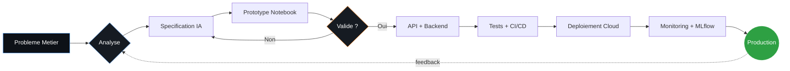
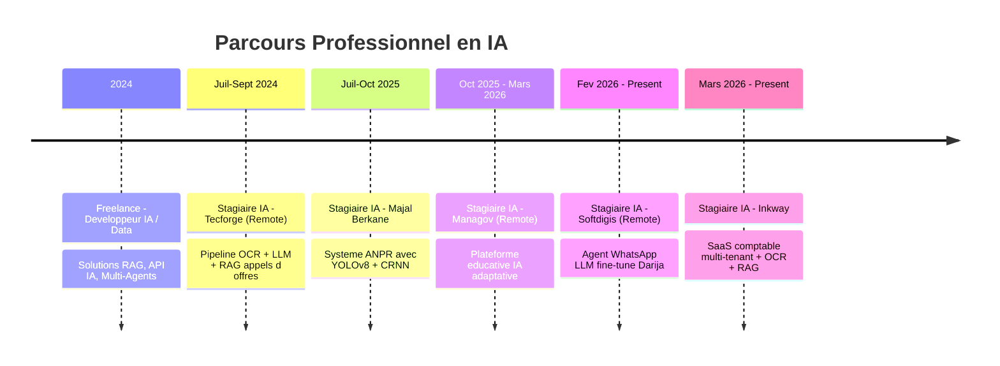

<!--
═══════════════════════════════════════════════════════════════════
  AHMED HAJJI · ARTIFICIAL INTELLIGENCE ENGINEER
  Portfolio README · Designed with precision, crafted with passion
═══════════════════════════════════════════════════════════════════
-->

<!-- ═════════════════════ HERO SECTION ═════════════════════ -->

<div align="center">


<a href="https://git.io/typing-svg">
  
</a>

<br/><br/>

<a href="https://github.com/Hajji-ahmed">
  
</a>
<a href="https://github.com/Hajji-ahmed?tab=followers">
  
</a>
<a href="#contact">
  
</a>
<a href="https://linkedin.com/in/ahmed-hajji-219247386">
  
</a>

<br/><br/>

<!-- NAVIGATION -->
<a href="#about"></a>
&nbsp;
<a href="#stack"></a>
&nbsp;
<a href="#projects"></a>
&nbsp;
<a href="#experience"></a>
&nbsp;
<a href="#stats"></a>
&nbsp;
<a href="#contact"></a>

</div>

<br/>


<br/>

<!-- ═════════════════════ KPI DASHBOARD ═════════════════════ -->

<div align="center">

<table>
<tr>
<td align="center" width="20%">
<br/>
<sub><b>EXPÉRIENCES IA</b><br/>Stages &amp; Freelance</sub>
</td>
<td align="center" width="20%">
<br/>
<sub><b>PROJETS LIVRÉS</b><br/>Production &amp; R&amp;D</sub>
</td>
<td align="center" width="20%">
<br/>
<sub><b>CERTIFICATIONS</b><br/>IBM &middot; Oracle &middot; MS</sub>
</td>
<td align="center" width="20%">
<br/>
<sub><b>TECHNOLOGIES</b><br/>Maîtrisées</sub>
</td>
<td align="center" width="20%">
<br/>
<sub><b>LANGUES</b><br/>AR &middot; FR &middot; EN</sub>
</td>
</tr>
</table>

</div>

<br/>

<!-- ═════════════════════ ABOUT ═════════════════════ -->

<a id="about"></a>


## 

<table>
<tr>
<td width="55%" valign="top">

```python
class AhmedHajji:
    """Artificial Intelligence Engineer - Berkane, Morocco"""

    def __init__(self) -> None:
        self.name      : str  = "Ahmed Hajji"
        self.role      : str  = "AI Engineer"
        self.school    : str  = "ENIAD - Ecole Nationale d'IA"
        self.location  : str  = "Berkane, Morocco"
        self.languages : list = ["Arabic", "French", "English"]

    def expertise(self) -> dict:
        return {
            "Generative AI"  : ["LLMs", "RAG", "Fine-Tuning"],
            "Computer Vision": ["YOLOv8", "OCR", "Detection"],
            "Multi-Agents"   : ["LangGraph", "CrewAI"],
            "MLOps"          : ["Docker", "CI/CD", "Cloud"],
        }

    def philosophy(self) -> str:
        return (
            "Ship production systems, not demos. "
            "Measure impact, not lines of code. "
            "Optimize for clarity, then performance."
        )

me = AhmedHajji()
print(me.philosophy())
```

</td>
<td width="45%" valign="top">

#### Profil

Ingénieur en Intelligence Artificielle, lauréat de l'**ENIAD Berkane**. Je conçois et déploie des solutions IA **de bout en bout** — de la modélisation à la mise en production.

Mon savoir-faire couvre l'**IA générative** (LLM, RAG, agents multi-modaux, fine-tuning), la **Computer Vision** et la **Data Science appliquée**. J'allie rigueur algorithmique, sens du produit et capacité à livrer des systèmes robustes à fort impact.

#### Focus actuel

`▸` Architectures multi-agents avancées <br/>
`▸` Pipelines OCR + RAG en production <br/>
`▸` LLMs fine-tunés en Darija marocain <br/>
`▸` SaaS IA multi-tenant scalable <br/>

#### Identité

| | |
|---|---|
| **Formation** | Ingénierie IA &mdash; ENIAD (2023 — Présent) |
| **Statut** | Stagiaire IA &mdash; Inkway, Softdigis, Managov |
| **Mail** | `ahmdhajy301@gmail.com` |
| **Tél.** | +212&nbsp;603&nbsp;251&nbsp;761 |

</td>
</tr>
</table>

<br/>

<!-- ═════════════════════ STACK TECHNIQUE ═════════════════════ -->

<a id="stack"></a>


## 

<div align="center">

<h3>Intelligence Artificielle</h3>

<p>


</p>

<table width="98%">
<thead>
<tr>
<th align="left" width="22%">Domaine</th>
<th align="left">Technologies &amp; Modèles</th>
<th align="center" width="14%">Niveau</th>
</tr>
</thead>
<tbody>
<tr>
<td><b>Deep Learning</b></td>
<td>CNN &middot; RNN &middot; LSTM &middot; Transformers &middot; Transfer Learning</td>
<td align="center"></td>
</tr>
<tr>
<td><b>LLMs &amp; NLP</b></td>
<td>GPT &middot; BERT &middot; Mistral &middot; LLaMA &middot; Fine-Tuning &middot; Prompt Engineering</td>
<td align="center"></td>
</tr>
<tr>
<td><b>RAG &amp; Search</b></td>
<td>LangChain &middot; LangGraph &middot; FAISS &middot; Chroma &middot; Vector Databases</td>
<td align="center"></td>
</tr>
<tr>
<td><b>Computer Vision</b></td>
<td>YOLOv8 &middot; CRNN &middot; OCR &middot; OpenCV &middot; Roboflow &middot; DocTR</td>
<td align="center"></td>
</tr>
<tr>
<td><b>Multi-Agents</b></td>
<td>LangGraph &middot; CrewAI &middot; Architectures autonomes</td>
<td align="center"></td>
</tr>
<tr>
<td><b>ML Classique</b></td>
<td>Supervised &middot; Unsupervised &middot; Ensemble Methods &middot; Reinforcement Learning</td>
<td align="center"></td>
</tr>
</tbody>
</table>

<br/>

<h3>Data Science &amp; Big Data</h3>

<p>


</p>

<sub>
<b>Engineering</b> &mdash; ETL/ELT &middot; Feature Engineering &middot; Data Cleaning &middot; Time Series<br/>
<b>Visualization</b> &mdash; Power BI &middot; Matplotlib &middot; Seaborn &middot; Plotly<br/>
<b>Big Data</b> &mdash; Hadoop &middot; Spark &middot; Distributed Processing
</sub>

<br/><br/>

<h3>Backend &amp; Frontend</h3>

<p>


</p>

<sub>
<b>Languages</b> &mdash; Python &middot; Java &middot; C/C++/C# &middot; SQL &middot; JavaScript / TypeScript<br/>
<b>Web</b> &mdash; React.js &middot; Next.js 15 &middot; FastAPI &middot; Flask &middot; NestJS &middot; Streamlit &middot; .NET
</sub>

<br/><br/>

<h3>DevOps, MLOps &amp; Cloud</h3>

<p>


</p>

<sub>
<b>MLOps</b> &mdash; Docker &middot; Compose &middot; GitHub Actions &middot; Jenkins &middot; MLflow &middot; CI/CD<br/>
<b>Cloud</b> &mdash; Azure (ML, Cognitive Services) &middot; AWS (EC2, S3, SageMaker)
</sub>

</div>

<br/>

<!-- ═════════════════════ MÉTHODOLOGIE ═════════════════════ -->


## 



<br/>

<!-- ═════════════════════ PROJETS PHARES ═════════════════════ -->

<a id="projects"></a>


## 

### Spotlight &mdash; Inkway Accounting SaaS

> *Projet en cours &middot; Mars 2026 — Présent &middot; Production*

<table>
<tr>
<td width="65%" valign="top">

**Plateforme SaaS multi-tenant** de gestion comptable adaptée au marché marocain. L'objectif : automatiser entièrement le cycle comptable, de l'extraction de documents au rapprochement bancaire.

**Architecture technique**
<br/>
&nbsp;&nbsp;`▸`&nbsp; Pipeline OCR fine-tuné (DocTR + ParseQ) pour factures et relevés
<br/>
&nbsp;&nbsp;`▸`&nbsp; Assistant conversationnel RAG sur documents comptables
<br/>
&nbsp;&nbsp;`▸`&nbsp; Moteur de rapprochement bancaire par scoring ML
<br/>
&nbsp;&nbsp;`▸`&nbsp; Backend FastAPI + NestJS &middot; Frontend Next.js 15 &middot; PostgreSQL multi-tenant
<br/>
&nbsp;&nbsp;`▸`&nbsp; Containerisation Docker &middot; Déploiement orchestré

**Impact attendu**
<br/>
&nbsp;&nbsp;`▸`&nbsp; Réduction du temps de saisie comptable de plus de 80%
<br/>
&nbsp;&nbsp;`▸`&nbsp; Fiabilité élevée sur l'extraction des données structurées

</td>
<td width="35%" valign="top">

<br/>

<div align="center">


<br/><br/>

<br/>

<br/>

<br/>

<br/>


</div>

</td>
</tr>
</table>

<br/>

### Autres Projets

<table>
<tr>
<td width="50%" valign="top">

#### LinkedIn Bot &mdash; Multi-Agents

> *Pipeline autonome de prospection commerciale*

Système à **trois agents collaboratifs** (scraping, engagement, vente) orchestrant le pipeline complet jusqu'à la conversion client B2B.

<sub>**Stack** &middot; LangGraph &middot; LLMs &middot; Web Scraping &middot; FastAPI</sub>
<sub>**Impact** &middot; Automatisation B2B end-to-end</sub>

</td>
<td width="50%" valign="top">

#### SmartGuide &mdash; IA Touristique

> *Plateforme intelligente de promotion touristique*

Moteur de **recommandations personnalisées** combiné à un système RAG fournissant des réponses contextuelles sur sites, hébergements et activités.

<sub>**Stack** &middot; RAG &middot; LLMs &middot; Vector DB &middot; React.js</sub>
<sub>**Impact** &middot; Expérience visiteur enrichie en temps réel</sub>

</td>
</tr>
<tr>
<td width="50%" valign="top">

#### ANPR &mdash; Reconnaissance de Plaques

> *Contrôle d'accès parking automatisé*

Système complet **YOLOv8 + CRNN** avec traitement temps réel et persistance SQL pour la gestion d'accès véhicules.

<sub>**Stack** &middot; YOLOv8 &middot; CRNN &middot; OpenCV &middot; Roboflow &middot; FastAPI</sub>
<sub>**Impact** &middot; Précision élevée en conditions réelles</sub>

</td>
<td width="50%" valign="top">

#### Darija WhatsApp Agent

> *Agent conversationnel LLM fine-tuné*

Agent WhatsApp basé sur un **LLM fine-tuné en Darija** marocain pour la validation et la confirmation des adresses de colis.

<sub>**Stack** &middot; PyTorch &middot; HuggingFace &middot; LangChain &middot; WhatsApp API</sub>
<sub>**Impact** &middot; Communication naturelle avec les clients locaux</sub>

</td>
</tr>
<tr>
<td width="50%" valign="top">

#### GreenH2Smart &mdash; Hydrogène Vert

> *IA pour la transition énergétique*

Plateforme de **monitoring, analyse et optimisation** de la production, du stockage et de la distribution d'hydrogène vert à l'échelle industrielle.

<sub>**Stack** &middot; ML &middot; IoT &middot; Time Series &middot; Analytics</sub>
<sub>**Impact** &middot; Efficacité énergétique industrielle</sub>

</td>
<td width="50%" valign="top">

#### Système Multi-Agents R&amp;D

> *Assistant pour la recherche scientifique*

Agents autonomes collaboratifs effectuant **scraping, synthèse et génération de rapports** scientifiques automatisés.

<sub>**Stack** &middot; LangChain &middot; LangGraph &middot; LLMs &middot; Web Search</sub>
<sub>**Impact** &middot; Accélération de la veille R&D</sub>

</td>
</tr>
</table>

<br/>

<!-- ═════════════════════ EXPÉRIENCE ═════════════════════ -->

<a id="experience"></a>


## 



<details>
<summary><b>&nbsp;Détails complets des expériences</b> &nbsp;&middot;&nbsp; <i>cliquer pour développer</i></summary>

<br/>

<table>
<tr><td>

##### Stagiaire IA &mdash; **Inkway** &nbsp;&middot;&nbsp; *Mars 2026 — Présent*

Conception d'un **SaaS multi-tenant de gestion comptable marocaine** avec pipeline OCR (DocTR + ParseQ) pour l'extraction automatique de factures et relevés bancaires, assistant conversationnel RAG, et rapprochement bancaire par scoring.

> **Stack** &mdash; Python &middot; FastAPI &middot; OCR fine-tuné &middot; RAG &middot; NestJS &middot; Next.js 15 &middot; PostgreSQL &middot; Docker

</td></tr>
<tr><td>

##### Stagiaire IA &mdash; **Softdigis** *(Remote)* &nbsp;&middot;&nbsp; *Fév. 2026 — Présent*

Développement d'un **agent conversationnel WhatsApp** basé sur un LLM fine-tuné en Darija pour la validation et la confirmation des adresses des colis.

> **Stack** &mdash; Python &middot; PyTorch &middot; Hugging Face &middot; LangChain &middot; FastAPI &middot; Next.js &middot; WhatsApp Business API

</td></tr>
<tr><td>

##### Stagiaire IA &mdash; **Managov** *(Remote)* &nbsp;&middot;&nbsp; *Oct. 2025 — Mars 2026*

**Plateforme d'éducation intelligente** avec personnalisation des parcours d'apprentissage et recommandations adaptatives basées sur l'analyse comportementale.

> **Stack** &mdash; Python &middot; LLM &middot; RAG &middot; LangChain &middot; Flask &middot; TTS &middot; STT &middot; React.js &middot; SQL

</td></tr>
<tr><td>

##### Stagiaire IA &mdash; **Majal Berkane** &nbsp;&middot;&nbsp; *Juil. 2025 — Oct. 2025*

**Système ANPR** de reconnaissance automatique de plaques d'immatriculation pour le contrôle d'accès aux parkings (YOLOv8 + CRNN + base SQL).

> **Stack** &mdash; YOLOv8 &middot; Roboflow &middot; OpenCV &middot; CRNN &middot; TensorFlow/Keras &middot; SQL &middot; FastAPI &middot; Streamlit

</td></tr>
<tr><td>

##### Stagiaire IA &mdash; **Tecforge** *(Remote)* &nbsp;&middot;&nbsp; *Juil. 2024 — Sept. 2024*

**Système d'extraction et d'analyse de PDF** d'appels d'offres : pipeline OCR + LLM open-source + RAG pour la recherche sémantique et la génération de réponses.

> **Stack** &mdash; RAG &middot; Mistral &middot; LangChain &middot; OCR &middot; FAISS &middot; PyPDF2 &middot; Python &middot; FastAPI

</td></tr>
<tr><td>

##### Freelance &mdash; **Développeur IA / Data** &nbsp;&middot;&nbsp; *2024 — Présent*

Développement de solutions IA pour clients : automatisation, API intelligentes, systèmes RAG, architectures multi-agents pour l'automatisation avancée.

</td></tr>
</table>

</details>

<br/>

<!-- ═════════════════════ STATISTIQUES GITHUB ═════════════════════ -->

<a id="stats"></a>


## 

<div align="center">

<table>
<tr>
<td>

</td>
<td>

</td>
</tr>
</table>


<br/><br/>


<br/><br/>


</div>

<br/>

<!-- ═════════════════════ FORMATION ═════════════════════ -->


## 

<table>
<tr>
<td width="50%" valign="top">

#### Parcours Académique

<table>
<thead>
<tr><th align="left">Diplôme</th><th align="left">Institution</th><th align="center">Année</th></tr>
</thead>
<tbody>
<tr><td><b>Ingénierie en IA</b></td><td>ENIAD Berkane</td><td align="center">2023 — Présent</td></tr>
<tr><td><b>DEUG Physique</b></td><td>Université Mohammed Premier</td><td align="center">2021 — 2023</td></tr>
<tr><td><b>Baccalauréat</b><br/><sub>Sciences Physiques</sub></td><td>Maroc</td><td align="center">2021</td></tr>
</tbody>
</table>

</td>
<td width="50%" valign="top">

#### Certifications

<table>
<thead>
<tr><th align="left">Certification</th><th align="left">Organisme</th></tr>
</thead>
<tbody>
<tr><td><b>AI Foundations</b></td><td>Oracle</td></tr>
<tr><td><b>Machine Learning with Python</b></td><td>IBM</td></tr>
<tr><td><b>Data Analysis with Python</b></td><td>IBM</td></tr>
<tr><td><b>Data Visualization</b></td><td>IBM</td></tr>
<tr><td><b>Analyste Data</b></td><td>Microsoft / LinkedIn</td></tr>
<tr><td><b>SQL Fundamentals</b></td><td>Simplilearn</td></tr>
</tbody>
</table>

</td>
</tr>
</table>

<br/>

<!-- ═════════════════════ SOFT SKILLS ═════════════════════ -->


## 

<div align="center">

<table>
<tr>
<td align="center" width="33%"><b>Pensée analytique</b><br/><sub>Résolution structurée &amp; rigoureuse</sub></td>
<td align="center" width="33%"><b>Autonomie</b><br/><sub>Initiative &amp; proactivité</sub></td>
<td align="center" width="33%"><b>Travail en équipe</b><br/><sub>Collaboration agile</sub></td>
</tr>
<tr>
<td align="center"><b>Communication</b><br/><sub>Vulgarisation technique</sub></td>
<td align="center"><b>Rigueur</b><br/><sub>Qualité &amp; précision</sub></td>
<td align="center"><b>Apprentissage rapide</b><br/><sub>Montée en compétence</sub></td>
</tr>
<tr>
<td align="center"><b>Veille technologique</b><br/><sub>Curiosité IA / R&amp;D</sub></td>
<td align="center"><b>Gestion de projet</b><br/><sub>Livrables &amp; délais</sub></td>
<td align="center"><b>Esprit d'innovation</b><br/><sub>Solutions créatives</sub></td>
</tr>
</table>

</div>

<br/>

<!-- ═════════════════════ CONTACT ═════════════════════ -->

<a id="contact"></a>


## 

<div align="center">

<table>
<tr>
<td align="center" width="50%">

#### Disponible pour

<br/><br/>
<br/><br/>
<br/><br/>


</td>
<td align="center" width="50%">

#### Domaines d'intérêt

<sub>
<b>Generative AI</b> &middot; <b>RAG Systems</b><br/>
<b>Multi-Agent Architectures</b><br/>
<b>Computer Vision</b> &middot; <b>OCR</b><br/>
<b>MLOps</b> &middot; <b>SaaS IA Multi-Tenant</b><br/>
<b>NLP &amp; Darija Language Tech</b>
</sub>

</td>
</tr>
</table>

<br/>

> *Ouvert aux opportunités, collaborations et projets innovants en Intelligence Artificielle.*
> *Réponse sous 24h en semaine.*

<br/>

<a href="https://linkedin.com/in/ahmed-hajji-219247386">
  
</a>
<a href="mailto:ahmdhajy301@gmail.com">
  
</a>
<a href="mailto:ahmed.hajji.23@ump.ac.ma">
  
</a>
<br/>
<a href="https://github.com/Hajji-ahmed">
  
</a>
<a href="tel:+212603251761">
  
</a>

</div>

<br/>

<!-- ═════════════════════ FOOTER ═════════════════════ -->


<div align="center">

<br/>

<a href="https://git.io/typing-svg">
  
</a>

<br/>

<sub>
Conçu avec rigueur &middot; Construit avec passion<br/>
Dernière mise à jour automatique &middot; <i>via GitHub Actions</i>
</sub>

</div>


