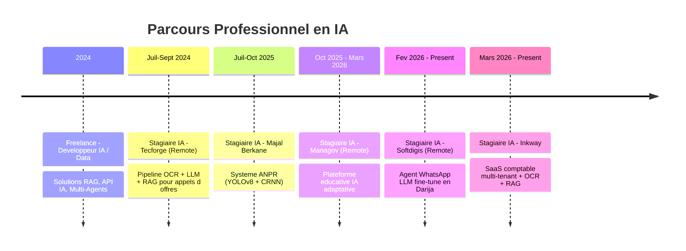

<!-- ====================== HEADER ANIMÉ ====================== -->

<div align="center">


<a href="https://git.io/typing-svg">
  
</a>

<br/>

<a href="https://github.com/Hajji-ahmed">
  
</a>
<a href="https://github.com/Hajji-ahmed?tab=followers">
  
</a>
<a href="https://linkedin.com/in/ahmed-hajji-219247386">
  
</a>
<a href="mailto:ahmdhajy301@gmail.com">
  
</a>

</div>

<br/>

<!-- ====================== À PROPOS ====================== -->


<br/>

## 

```python
class AhmedHajji:
    def __init__(self):
        self.name      = "Ahmed Hajji"
        self.role      = "Artificial Intelligence Engineer"
        self.school    = "ENIAD - Ecole Nationale d'IA et du Digital"
        self.location  = "Berkane, Maroc"
        self.languages = ["Arabe (natif)", "Francais (courant)", "Anglais (intermediaire)"]

    def expertise(self) -> dict:
        return {
            "Generative AI"  : ["LLMs", "RAG", "Fine-Tuning", "Multi-Agents"],
            "Computer Vision": ["YOLOv8", "OCR", "Object Detection"],
            "Data Science"   : ["ETL/ELT", "Time Series", "Big Data"],
            "MLOps"          : ["Docker", "MLflow", "CI/CD", "Cloud"],
        }

    def current_focus(self) -> list:
        return [
            "Architectures multi-agents avancees (LangGraph, CrewAI)",
            "Pipelines OCR + RAG pour la documentation intelligente",
            "LLMs fine-tunes en Darija (dialecte marocain)",
            "Deploiement de solutions IA SaaS multi-tenant",
        ]

    def motto(self) -> str:
        return "Transformer les donnees en intelligence, l'intelligence en innovation."


me = AhmedHajji()
print(me.motto())
```

> **Formation** &nbsp;&middot;&nbsp; Ingénierie en Intelligence Artificielle &mdash; ENIAD &nbsp;(2023 — Présent)
> **Statut** &nbsp;&middot;&nbsp; Ingénieur IA &mdash; Stagiaire chez Inkway, Softdigis & Managov
> **Contact** &nbsp;&middot;&nbsp; `ahmed.hajji.23@ump.ac.ma` &nbsp;&middot;&nbsp; `ahmdhajy301@gmail.com`
> **Téléphone** &nbsp;&middot;&nbsp; +212&nbsp;603&nbsp;251&nbsp;761

<br/>

<!-- ====================== STACK TECHNIQUE ====================== -->


## 

<div align="center">

<h3>Intelligence Artificielle &amp; Machine Learning</h3>

<p>


</p>

<table>
<thead>
<tr>
<th width="30%" align="left">Domaine</th>
<th align="left">Technologies &amp; Modèles</th>
</tr>
</thead>
<tbody>
<tr><td><b>Deep Learning</b></td><td>CNN &middot; RNN &middot; LSTM &middot; Transformers &middot; Transfer Learning</td></tr>
<tr><td><b>LLMs &amp; NLP</b></td><td>GPT &middot; BERT &middot; Mistral &middot; LLaMA &middot; Fine-Tuning &middot; Prompt Engineering</td></tr>
<tr><td><b>RAG &amp; Search</b></td><td>LangChain &middot; LangGraph &middot; FAISS &middot; Chroma &middot; Vector Databases</td></tr>
<tr><td><b>Computer Vision</b></td><td>YOLOv8 &middot; CRNN &middot; OCR &middot; OpenCV &middot; Roboflow</td></tr>
<tr><td><b>Multi-Agents</b></td><td>LangGraph &middot; CrewAI &middot; Architectures autonomes</td></tr>
</tbody>
</table>

<br/>

<h3>Data Science &amp; Analyse</h3>

<p>


</p>

<sub>
<b>Data Engineering</b> &mdash; ETL/ELT &middot; Feature Engineering &middot; Data Cleaning &middot; Séries Temporelles<br/>
<b>Visualisation</b> &mdash; Power BI &middot; Matplotlib &middot; Seaborn &middot; Plotly<br/>
<b>Big Data</b> &mdash; Hadoop &middot; Spark &middot; Distributed Processing
</sub>

<br/><br/>

<h3>Développement Backend &amp; Frontend</h3>

<p>


</p>

<sub>
<b>Langages</b> &mdash; Python &middot; Java &middot; C/C++/C# &middot; SQL &middot; JavaScript / TypeScript<br/>
<b>Frameworks Web</b> &mdash; React.js &middot; Next.js 15 &middot; FastAPI &middot; Flask &middot; NestJS &middot; Streamlit &middot; .NET
</sub>

<br/><br/>

<h3>DevOps, MLOps &amp; Cloud</h3>

<p>


</p>

<sub>
<b>MLOps</b> &mdash; Docker &middot; Docker Compose &middot; GitHub Actions &middot; Jenkins &middot; MLflow &middot; CI/CD<br/>
<b>Cloud</b> &mdash; Azure (ML, Cognitive Services) &middot; AWS (EC2, S3, SageMaker)
</sub>

</div>

<br/>

<!-- ====================== PROJETS PHARES ====================== -->


## 

<table>
<tr>
<td width="50%" valign="top">

#### LinkedIn Bot &mdash; Multi-Agents
> Pipeline autonome de prospection commerciale

Système à **trois agents collaboratifs** (scraping, engagement, vente) orchestrant le pipeline complet jusqu'à la conversion client.

**Stack** &middot; LangGraph &middot; LLMs &middot; Web Scraping &middot; FastAPI
**Impact** &middot; Automatisation B2B end-to-end

</td>
<td width="50%" valign="top">

#### SmartGuide &mdash; IA Touristique
> Plateforme intelligente de promotion touristique

Moteur de **recommandations personnalisées** combiné à un système RAG fournissant des réponses contextuelles sur sites, hébergements et activités.

**Stack** &middot; RAG &middot; LLMs &middot; Vector DB &middot; React.js
**Impact** &middot; Expérience visiteur enrichie en temps réel

</td>
</tr>
<tr>
<td width="50%" valign="top">

#### ANPR &mdash; Reconnaissance de Plaques
> Contrôle d'accès parking automatisé

Système complet **YOLOv8 + CRNN** avec traitement temps réel et persistance SQL pour la gestion d'accès véhicules.

**Stack** &middot; YOLOv8 &middot; CRNN &middot; OpenCV &middot; Roboflow &middot; FastAPI
**Impact** &middot; Précision élevée en conditions réelles

</td>
<td width="50%" valign="top">

#### Assistant Intelligent pour Factures
> Extraction automatisée et conversation IA

Pipeline **OCR + LLM + RAG** pour extraire montants, dates et fournisseurs, accompagné d'un assistant conversationnel.

**Stack** &middot; DocTR &middot; ParseQ &middot; LLM &middot; RAG &middot; LangChain
**Impact** &middot; Gain de temps majeur en comptabilité

</td>
</tr>
<tr>
<td width="50%" valign="top">

#### GreenH2Smart &mdash; Hydrogène Vert
> IA pour la transition énergétique

Plateforme de **monitoring, analyse et optimisation** de la production, du stockage et de la distribution d'hydrogène vert à l'échelle industrielle.

**Stack** &middot; ML &middot; IoT &middot; Time Series &middot; Analytics
**Impact** &middot; Efficacité énergétique industrielle

</td>
<td width="50%" valign="top">

#### Système Multi-Agents R&amp;D
> Assistant pour la recherche scientifique

Agents autonomes collaboratifs effectuant **scraping, synthèse et génération de rapports** scientifiques automatisés.

**Stack** &middot; LangChain &middot; LangGraph &middot; LLMs &middot; Web Search
**Impact** &middot; Accélération de la veille R&D

</td>
</tr>
</table>

<br/>

<!-- ====================== EXPÉRIENCE ====================== -->


## 



<details>
<summary><b>Détails des expériences</b> &nbsp;&mdash;&nbsp; <i>cliquer pour développer</i></summary>

<br/>

<table>
<tr><td>

##### Stagiaire IA &mdash; **Inkway** &nbsp;&middot;&nbsp; *Mars 2026 — Présent*

Conception d'un **SaaS multi-tenant de gestion comptable marocaine** avec pipeline OCR (DocTR + ParseQ) pour l'extraction automatique de factures et relevés bancaires, assistant conversationnel RAG, et rapprochement bancaire par scoring.

> **Stack** &mdash; Python &middot; FastAPI &middot; OCR fine-tuné &middot; RAG &middot; NestJS &middot; Next.js 15 &middot; PostgreSQL &middot; Docker

</td></tr>
<tr><td>

##### Stagiaire IA &mdash; **Softdigis** *(Remote)* &nbsp;&middot;&nbsp; *Fév. 2026 — Présent*

Développement d'un **agent conversationnel WhatsApp** basé sur un LLM fine-tuné en Darija pour la validation et la confirmation des adresses des colis.

> **Stack** &mdash; Python &middot; PyTorch &middot; Hugging Face &middot; LangChain &middot; FastAPI &middot; Next.js &middot; WhatsApp Business API

</td></tr>
<tr><td>

##### Stagiaire IA &mdash; **Managov** *(Remote)* &nbsp;&middot;&nbsp; *Oct. 2025 — Mars 2026*

**Plateforme d'éducation intelligente** avec personnalisation des parcours d'apprentissage et recommandations adaptatives basées sur l'analyse comportementale.

> **Stack** &mdash; Python &middot; LLM &middot; RAG &middot; LangChain &middot; Flask &middot; TTS &middot; STT &middot; React.js &middot; SQL

</td></tr>
<tr><td>

##### Stagiaire IA &mdash; **Majal Berkane** &nbsp;&middot;&nbsp; *Juil. 2025 — Oct. 2025*

**Système ANPR** de reconnaissance automatique de plaques d'immatriculation pour le contrôle d'accès aux parkings (YOLOv8 + CRNN + base SQL).

> **Stack** &mdash; YOLOv8 &middot; Roboflow &middot; OpenCV &middot; CRNN &middot; TensorFlow/Keras &middot; SQL &middot; FastAPI &middot; Streamlit

</td></tr>
<tr><td>

##### Stagiaire IA &mdash; **Tecforge** *(Remote)* &nbsp;&middot;&nbsp; *Juil. 2024 — Sept. 2024*

**Système d'extraction et d'analyse de PDF** d'appels d'offres : pipeline OCR + LLM open-source + RAG pour la recherche sémantique et la génération de réponses.

> **Stack** &mdash; RAG &middot; Mistral &middot; LangChain &middot; OCR &middot; FAISS &middot; PyPDF2 &middot; Python &middot; FastAPI

</td></tr>
<tr><td>

##### Freelance &mdash; **Développeur IA / Data** &nbsp;&middot;&nbsp; *2024 — Présent*

Développement de solutions IA pour clients : automatisation, API intelligentes, systèmes RAG, architectures multi-agents pour l'automatisation avancée.

</td></tr>
</table>

</details>

<br/>

<!-- ====================== STATISTIQUES ====================== -->


## 

<div align="center">

<table>
<tr>
<td>

</td>
<td>

</td>
</tr>
</table>


<br/><br/>


<br/><br/>


</div>

<br/>

<!-- ====================== FORMATION ====================== -->


## 

<div align="center">

<h3>Formation Académique</h3>

<table>
<thead>
<tr><th align="left">Diplôme</th><th align="left">Établissement</th><th align="center">Période</th></tr>
</thead>
<tbody>
<tr><td><b>Ingénierie en Intelligence Artificielle</b></td><td>ENIAD Berkane</td><td align="center">2023 — Présent</td></tr>
<tr><td><b>DEUG Physique</b></td><td>Université Mohammed Premier (UMP)</td><td align="center">2021 — 2023</td></tr>
<tr><td><b>Baccalauréat &mdash; Sciences Physiques</b></td><td>—</td><td align="center">2021</td></tr>
</tbody>
</table>

<br/>

<h3>Certifications Professionnelles</h3>

<table>
<thead>
<tr><th align="left">Certification</th><th align="left">Organisme</th><th align="left">Domaine</th></tr>
</thead>
<tbody>
<tr><td><b>AI Foundations</b></td><td>Oracle</td><td>Intelligence Artificielle</td></tr>
<tr><td><b>Machine Learning with Python</b></td><td>IBM</td><td>Machine Learning</td></tr>
<tr><td><b>Data Analysis with Python</b></td><td>IBM</td><td>Data Science</td></tr>
<tr><td><b>Data Visualization</b></td><td>IBM</td><td>Visualisation</td></tr>
<tr><td><b>Analyste Data</b></td><td>Microsoft / LinkedIn</td><td>Data Analytics</td></tr>
<tr><td><b>SQL Fundamentals</b></td><td>Simplilearn</td><td>Bases de données</td></tr>
</tbody>
</table>

</div>

<br/>

<!-- ====================== SOFT SKILLS ====================== -->


## 

<div align="center">

<table>
<tr>
<td align="center" width="33%"><b>Pensée analytique</b><br/><sub>Résolution structurée</sub></td>
<td align="center" width="33%"><b>Autonomie</b><br/><sub>Prise d'initiative</sub></td>
<td align="center" width="33%"><b>Travail en équipe</b><br/><sub>Collaboration agile</sub></td>
</tr>
<tr>
<td align="center"><b>Communication</b><br/><sub>Vulgarisation technique</sub></td>
<td align="center"><b>Rigueur</b><br/><sub>Qualité &amp; précision</sub></td>
<td align="center"><b>Apprentissage rapide</b><br/><sub>Montée en compétence</sub></td>
</tr>
<tr>
<td align="center"><b>Veille technologique</b><br/><sub>Curiosité IA / R&amp;D</sub></td>
<td align="center"><b>Gestion de projet</b><br/><sub>Livrables &amp; délais</sub></td>
<td align="center"><b>Esprit d'innovation</b><br/><sub>Solutions créatives</sub></td>
</tr>
</table>

</div>

<br/>

<!-- ====================== CONTACT ====================== -->


## 

<div align="center">

> *Ouvert aux opportunités, collaborations et projets innovants en Intelligence Artificielle*

<br/>

<a href="https://linkedin.com/in/ahmed-hajji-219247386">
  
</a>
<a href="mailto:ahmdhajy301@gmail.com">
  
</a>
<a href="mailto:ahmed.hajji.23@ump.ac.ma">
  
</a>
<a href="https://github.com/Hajji-ahmed">
  
</a>
<a href="tel:+212603251761">
  
</a>

</div>

<br/>

<!-- ====================== FOOTER ====================== -->

<div align="center">

<a href="https://git.io/typing-svg">
  
</a>

</div>


